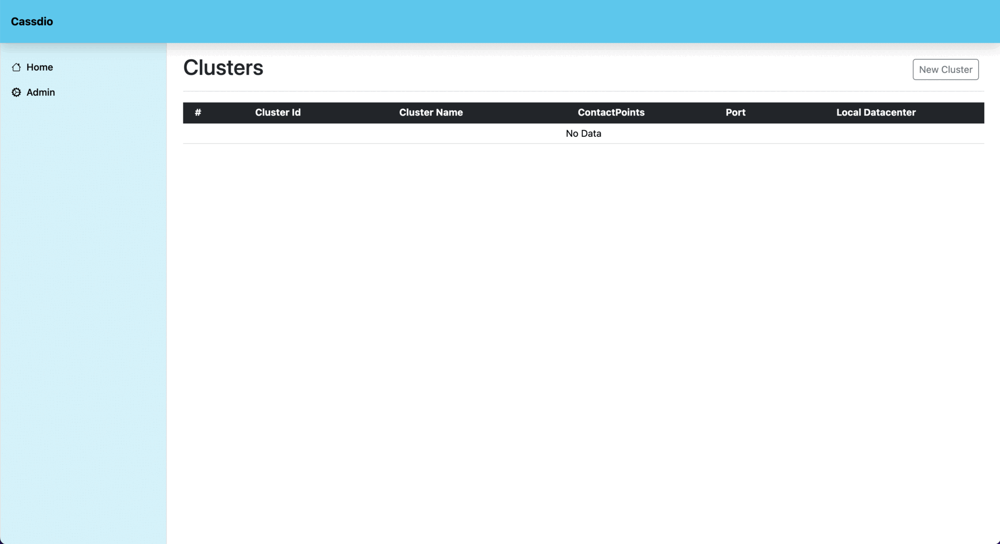

# Cassdio (`Cass`andra Stu`dio`)
Cassdio is centralized web management system for managing [Apache Cassandra](https://cassandra.apache.org/_/index.html)!

Cassdio provide powerful tools to efficiently manage and monitor Apache Cassandra databases. You can monitor the real-time status of your database clusters and perform various tasks intuitively through a user-friendly interface.

This management system helps simplify system operations and enhance stability. It's an essential tool for managing Apache Cassandra databases, offering excellent functionality and user convenience.

[](https://github.com/hakdang/cassdio/releases)

## Demo


## Features
- `Multi Cassandra Cluster(With AuthCredentials)`
    - Node Monitoring
- `View Keysapce`
    - User Created Keyspace(with System Keyspace)
- `View Table`
    - View Row Data
    - View Definition
- `Simple Query Editor`
    - CQL Query

## Requirements
- JDK 21

### Support Versions

Version | Supported | Cassandra Docs
-- | -- | --
3.11 | O | [Link](https://cassandra.apache.org/doc/3.11/index.html)
4.0 | O | [Link](https://cassandra.apache.org/doc/4.0/index.html)
4.1 | O | [Link](https://cassandra.apache.org/doc/4.1/index.html)
5.0 | O | [Link](https://cassandra.apache.org/doc/5.0/index.html)

## Getting Started

### Installation

```
wget https://github.com/hakdang/cassdio/releases/download/v0.0.2/cassdio-0.0.2.jar

java -jar ./cassdio-0.0.2.jar
```

### Browser

> http://localhost:20000

### Jar Build Command

> ./gradlew :clean :cassdio-web:build -Pfrontend=true

[//]: # (## Environment)

[//]: # ()
[//]: # (env name | description | env value | default value)

[//]: # (-- | -- | -- | --)

[//]: # (CASSDIO_DATABASE_PATH | database file path | -dDB_PATH:test | ${userHome}/.cassdio)

[//]: # ()

