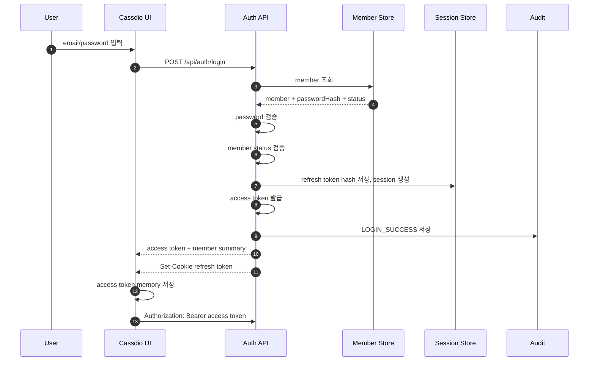
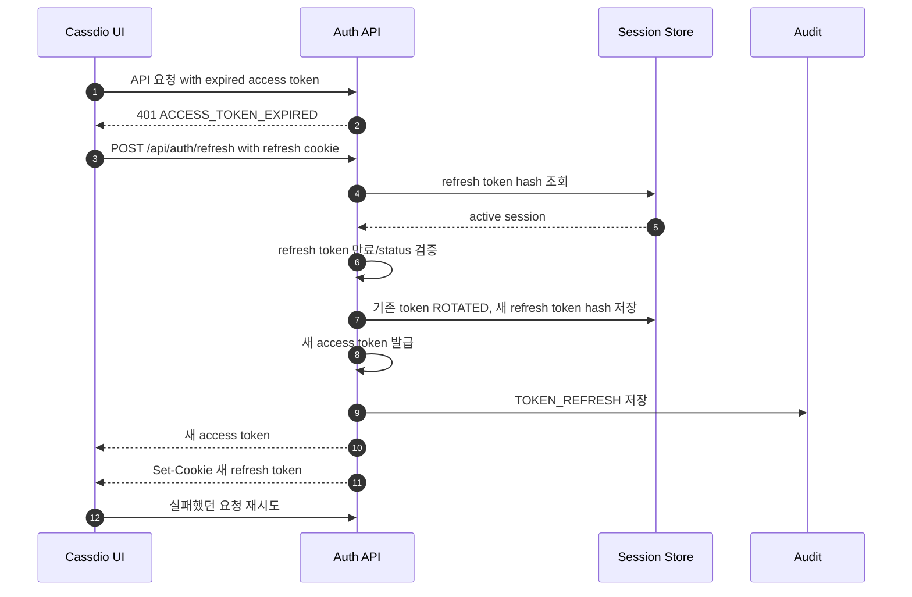

# Phase 3 - Milestone 2: Login & Token Session

## 개요

Cassdio 로그인은 Phase 3에서 구현하는 것이 좋습니다. Phase 1에서는 login page와 route guard placeholder만 만들고, 실제 인증/인가/session 처리는 Member 모델이 생긴 뒤 Phase 3 Milestone 2에서 구현합니다.

권장 방식은 JWT access token + refresh token rotation입니다.

- Access Token: 짧은 만료 시간, stateless API 인증용
- Refresh Token: 긴 만료 시간, 서버에 hash로 저장, 재발급 시 rotation
- Session: refresh token 단위로 관리하며 device/browser별 로그아웃과 강제 만료를 지원

## 최종 권장안

Cassdio는 운영 콘솔이므로 보안과 UX의 균형을 위해 다음 방식을 권장합니다.

```text
Access Token  : 짧게 유지, UI memory 보관, Authorization header로 전송
Refresh Token : httpOnly Secure SameSite cookie 보관, 서버에는 hash만 저장
Session       : refresh token 단위로 서버에서 관리
권한          : JWT에 넣지 않고 API 요청 시 MemberPrincipal + PermissionEvaluator로 판단
```

이 방식은 XSS로 refresh token이 직접 탈취되는 위험을 줄이고, refresh token revoke를 통해 로그아웃/강제 로그아웃/탈취 대응을 서버에서 제어할 수 있습니다.

## 개발 단계 배치

| 단계 | 내용 | 이유 |
|---|---|---|
| Phase 1 M3 | Login Page, route guard shell | UI 진입점과 비로그인 redirect만 준비 |
| Phase 2 M3 | Super Admin seed | 최초 로그인 가능한 local member 생성 |
| Phase 3 M1 | Member/Workspace 모델 | 로그인 주체와 membership을 먼저 정의 |
| Phase 3 M2 | Login/JWT/Refresh Token | 실제 인증과 session 유지 구현 |
| Phase 3 M3-M4 | Role/Permission | 로그인된 member 기준 권한 판단 구현 |

## Token 설계

| Token | 저장 위치 | 만료 | 서버 저장 | 용도 |
|---|---|---:|---|---|
| Access Token | memory 또는 httpOnly cookie | 5~15분 | 저장하지 않음 | API 인증 |
| Refresh Token | httpOnly Secure cookie 권장 | 7~30일 | hash 저장 | access token 재발급 |

운영 콘솔 특성상 refresh token은 localStorage보다 httpOnly Secure SameSite cookie에 저장하는 방식을 권장합니다. Access token은 memory에 보관하고 API 호출 시 `Authorization: Bearer`로 전달하거나, cookie 기반 인증으로 통일할 수 있습니다.

cookie로 refresh token을 보낼 경우 `/api/auth/refresh`, `/api/auth/logout` 같은 endpoint는 CSRF 방어를 적용합니다. SameSite=Lax/Strict를 기본으로 두고, cross-site 배포가 필요해 SameSite=None을 쓰는 경우 CSRF token 또는 double-submit cookie를 함께 사용합니다.

## Auth API

| API | 설명 |
|---|---|
| POST /api/auth/login | email/password 검증 후 access token과 refresh cookie 발급 |
| POST /api/auth/refresh | refresh cookie 검증, refresh token rotation, 새 access token 발급 |
| POST /api/auth/logout | 현재 session revoke, refresh cookie 삭제 |
| POST /api/auth/logout-all | member의 모든 session revoke |
| GET /api/auth/me | 현재 로그인 member, workspace, session 요약 조회 |
| GET /api/auth/sessions | 현재 member의 session/device 목록 조회 |
| DELETE /api/auth/sessions/{sessionId} | 특정 session revoke |

## 권장 Cookie 정책

| 항목 | 권장값 |
|---|---|
| refresh token cookie | `cassdio_refresh_token` |
| HttpOnly | true |
| Secure | production true |
| SameSite | Lax 또는 Strict |
| Path | `/api/auth` |
| Max-Age | refresh token 만료와 동일 |

## Access Token Claims

```json
{
  "iss": "cassdio",
  "sub": "member_01H...",
  "sid": "session_01H...",
  "email": "admin@example.com",
  "workspace_id": "workspace_default",
  "token_type": "access",
  "iat": 1710000000,
  "exp": 1710000900
}
```

Access token에는 권한 목록 전체를 넣지 않는 것을 권장합니다. role/permission은 변경될 수 있으므로 API 요청마다 permission cache 또는 evaluator에서 계산합니다. Token에는 member/session/workspace 식별에 필요한 최소 claim만 둡니다.

## Refresh Token 저장 모델

| 필드 | 설명 |
|---|---|
| sessionId | session 식별자. access token의 `sid`와 연결 |
| memberId | 로그인 member |
| refreshTokenHash | 원본 refresh token은 저장하지 않고 hash만 저장 |
| tokenFamilyId | rotation chain 식별자 |
| previousTokenHash | 재사용 탐지용 이전 token hash |
| deviceName | 브라우저/OS/user agent 요약 |
| ipAddress | 로그인 IP |
| userAgentHash | user agent fingerprint |
| status | ACTIVE, ROTATED, REVOKED, EXPIRED, COMPROMISED |
| expiresAt | refresh token 만료 시각 |
| rotatedAt | 마지막 rotation 시각 |
| revokedAt | 로그아웃/강제 만료 시각 |

## 로그인 플로우



## API 요청 인증 플로우

```text
1. UI가 access token으로 API 호출
2. API filter가 JWT signature, exp, token_type, session id를 검증
3. member status와 session status를 확인
4. SecurityContext에 MemberPrincipal 저장
5. Controller/Service에서 permission evaluator 호출
```

## Access Token 만료 / Refresh 플로우



## Refresh Token 재사용 탐지

Refresh token은 한 번 사용되면 즉시 rotation합니다. 이미 ROTATED 된 refresh token이 다시 들어오면 탈취 가능성이 있으므로 같은 token family 전체를 `COMPROMISED`로 바꾸고 재로그인을 요구합니다.

```text
1. refresh 요청 수신
2. token hash가 ACTIVE면 정상 rotation
3. token hash가 ROTATED/REVOKED인데 재사용되면 token family 전체 revoke
4. 해당 member의 모든 session revoke 여부는 정책으로 결정
5. SECURITY_TOKEN_REUSE_DETECTED audit 저장
```

## Logout 플로우

| API | 동작 |
|---|---|
| POST /api/auth/logout | 현재 refresh session revoke, refresh cookie 삭제 |
| POST /api/auth/logout-all | member의 모든 active session revoke |
| GET /api/auth/sessions | 현재 로그인된 device/session 목록 조회 |
| DELETE /api/auth/sessions/{sessionId} | 특정 session 강제 로그아웃 |

## 포함된 Features

### Feature 1. Local Login API 구현
**설명**: email/password로 로그인하고 member status를 검증한다.

**체크리스트**:
- [ ] POST /api/auth/login 구현
- [ ] password hash 검증
- [ ] PENDING/SUSPENDED/DISABLED member 차단
- [ ] 로그인 실패 횟수 제한
- [ ] LOGIN_SUCCESS / LOGIN_FAILED audit 저장

---

### Feature 2. JWT Access Token 발급/검증 구현
**설명**: 짧은 만료 시간의 access token을 발급하고 API 인증에 사용한다.

**체크리스트**:
- [ ] JWT issuer/audience/signing key 설정
- [ ] token claims 정의
- [ ] authentication filter 구현
- [ ] token expiry error code 정의

---

### Feature 3. Refresh Token Rotation 구현
**설명**: refresh token을 hash로 저장하고 재발급 시 매번 rotation한다.

**체크리스트**:
- [ ] refresh token random value 생성
- [ ] refresh token hash 저장
- [ ] token family 관리
- [ ] 재사용 탐지 시 family revoke

---

### Feature 4. Session 관리 구현
**설명**: refresh token 단위 session을 관리하고 device별 로그아웃을 지원한다.

**체크리스트**:
- [ ] member session 모델 정의
- [ ] session list API
- [ ] current session logout
- [ ] logout all
- [ ] 관리자 강제 session revoke

---

### Feature 5. Frontend Auth Guard 구현
**설명**: 로그인 여부에 따라 route 접근을 제어하고 token refresh를 자동 처리한다.

**체크리스트**:
- [ ] login page submit 연동
- [ ] access token memory 저장
- [ ] 401 발생 시 refresh 후 요청 재시도
- [ ] refresh 실패 시 login redirect
- [ ] current member context 구성

---

### Feature 6. Auth Audit 구현
**설명**: 로그인, 로그아웃, refresh, token 재사용 탐지, session revoke를 audit로 저장한다.

**체크리스트**:
- [ ] auth audit action 정의
- [ ] IP/user agent 저장
- [ ] 실패 사유 코드 저장
- [ ] security event severity 정의

## 완료 기준

- [ ] local member가 email/password로 로그인할 수 있다.
- [ ] access token 만료 시 refresh token으로 자동 재발급된다.
- [ ] refresh token은 rotation되고 재사용 탐지가 동작한다.
- [ ] logout과 logout-all이 refresh session을 무효화한다.
- [ ] 모든 auth event가 audit에 남는다.
